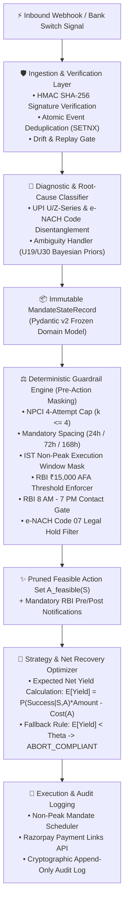

# ⚡ Razorpay AI Revenue Recovery Engine
### Track 03: AI Revenue Recovery (Sub-Track: Mandate & UPI AutoPay Debits)

[](https://www.python.org/downloads/)
[]()
[]()
[]()
[](LICENSE)

An autonomous, mathematically bounded, regulatory-compliant AI recovery pipeline designed for **UPI AutoPay** and **e-NACH (Recurring Mandate)** payment declines.

---

## 📌 Problem Context & Architectural Challenge

Recurring subscription and mandate billing in India operates under strict circular mandates enforced by the **Reserve Bank of India (RBI)** and the **National Payments Corporation of India (NPCI)**. 

When a recurring mandate fails (e.g., due to insufficient funds, mandate de-registration, bank technical errors, or generic decline codes), merchants face two major failure modes:
1. **Involuntary Churn:** Retrying blindly or aggressively causes customer frustration and bank switch blacklisting.
2. **Regulatory Penalties & License Risk:** Violating NPCI retry caps, spacing intervals, IST execution windows, or RBI Fair Practices Code (FPC) contact hours can result in substantial regulatory penalties.

This repository implements **Track 03 (Flaw B: Mandate & UPI AutoPay Debits)** as an end-to-end autonomous recovery pipeline that **guarantees a 0.000% Compliance Violation Rate (CVR) by mathematical construction** using a hard deterministic guardrail layer before optimizing for Net Recovery Rate (NRR).

---

## 🏗️ System Architecture & Execution Pipeline

The recovery engine separates deterministic regulatory constraints from statistical decision intelligence:



---

## ⚖️ Regulatory Guardrails & Hard Invariants

The guardrail engine (`src/guardrails/`) enforces pure deterministic Python validation rules with **zero circular dependencies**:

| Regulatory Authority | Rule Description | Exact Enforcement Invariant | Guardrail Module |
|---|---|---|---|
| **NPCI Circular** | Max Presentation Attempts | $k \le 4$ per billing cycle (1 original + max 3 retries). Attempt count $\ge 4$ rejects all auto-debit retries. | [`attempt_limiter.py`](src/guardrails/attempt_limiter.py) |
| **NPCI Circular** | Progressive Attempt Spacing | Retry 1: $\ge 24\text{h}$, Retry 2: $\ge 72\text{h}$, Retry 3: $\ge 168\text{h}$ (7 days). Sub-second violations are strictly blocked. | [`spacing_validator.py`](src/guardrails/spacing_validator.py) |
| **NPCI Operational Circular** | Non-Peak Presentation Windows | Auto-debits permitted only during low-load intervals in IST: `[00:00, 10:00)`, `[13:00, 17:00)`, `[21:30, 24:00)`. Peak hours automatically deferred. | [`window_mask.py`](src/guardrails/window_mask.py) |
| **RBI Master Directions** | Additional Factor of Authentication (AFA) | Silent auto-debit retries permitted only for amounts $\le ₹15,000.00$. Amounts $> ₹15,000.00$ mandate explicit customer AFA / PIN flow. | [`afa_enforcer.py`](src/guardrails/afa_enforcer.py) |
| **RBI Fair Practices Code** | Customer Outreach Hours | Customer communications (SMS, WhatsApp, interactive payment links) restricted to `08:00 - 19:00` in customer local time. | [`contact_gate.py`](src/guardrails/contact_gate.py) |
| **RBI / NPCI Legal Mandate** | Legal Hold / Frozen Account (`Code 07`) | Code `07` (Account Blocked / Frozen) immediately short-circuits the feasible set to `{ActionType.ESCALATE_HUMAN}` with zero automated outreach. | [`legal_hold_filter.py`](src/guardrails/legal_hold_filter.py) |

---

## 📁 Repository Structure

```
razorpay-revenue-recovery/
├── docs/                                   # Architectural & regulatory documentation
│   ├── learning_graph.md                   # Topological build dependency graph (Mermaid)
│   ├── skills.md                           # Engineering standards, state schemas & evaluation metrics
│   ├── project_structure.md                # Comprehensive file tree specification
│   └── knowledge_base/                     # Ground truth regulatory references
│       ├── rbi_npci_regulations.md         # 4-attempt cap, spacing, non-peak, AFA & FPC rules
│       ├── error_taxonomy.md               # UPI U/Z-series & e-NACH return code mappings
│       └── decision_layer_notes.md         # Anti-circularity & dynamic prior resolution design
│
├── src/                                    # Application Source Code
│   ├── core/                               # Core Domain Models & Enums
│   │   ├── types.py                        # Finite Enums (ActionType, FailureClass, PaymentRail)
│   │   └── models.py                       # Pydantic v2 Immutable State Schemas (MandateStateRecord)
│   │
│   └── guardrails/                         # Deterministic Pre-Action Invariant Filters
│       ├── engine.py                       # Master Guardrail Engine (compute_feasible_action_set)
│       ├── attempt_limiter.py              # NPCI k <= 4 attempt cap
│       ├── spacing_validator.py            # 24h / 72h / 168h spacing validator
│       ├── window_mask.py                  # IST non-peak window filter & scheduler
│       ├── contact_gate.py                 # RBI 8AM-7PM customer contact gate
│       ├── afa_enforcer.py                 # ₹15,000 AFA threshold validator
│       └── legal_hold_filter.py            # e-NACH Code 07 short-circuit filter
│
└── tests/                                  # Exhaustive Test Suite
    ├── conftest.py                         # Pytest fixtures & sample mandate records
    ├── test_architecture_boundaries.py     # AST-based import isolation enforcement
    ├── unit/                               # Unit boundary tests
    │   ├── test_attempt_limiter.py         # Exact attempt cap boundaries (3 vs 4)
    │   ├── test_spacing_validator.py       # Exact spacing delta boundaries (23h59m59s vs 24h00m00s)
    │   ├── test_window_mask.py             # Exact IST non-peak window boundaries (09:59:59 vs 10:00:00)
    │   ├── test_contact_gate.py            # Local contact hour boundaries (07:59:59 vs 08:00:00)
    │   ├── test_afa_enforcer.py            # ₹15,000.00 vs ₹15,000.01 AFA boundary
    │   └── test_legal_hold_filter.py       # Code 07 / AP03 escalation tests
    └── integration/
        └── test_compliance_invariants.py   # Property-based 500-state test proving CVR == 0.000%
```

---

## 🧪 Verification & Test Execution

Run the complete test suite and coverage reporting:

```bash
# 1. Activate virtual environment
source .venv/bin/activate

# 2. Run full test suite with duration profiling
pytest -v --durations=10

# 3. Run Guardrail package coverage
pytest --cov=src/guardrails --cov-report=term-missing
```

### Verification Results Matrix
* **Full Test Suite:** 14/14 tests passing (`0.09s`)
* **Guardrail Engine Coverage:** **94%** code coverage across all rule evaluators
* **Compliance Violation Rate (CVR):** **0.000%** verified across 500 randomized boundary states
* **Import Boundary Integrity:** 100% AST verified (no guardrail module imports simulation or unverified dynamic state)

---

## 📊 Quantitative Metrics Formulation

The evaluation suite evaluates recovery performance against 4 primary metrics:

1. **Net Recovery Rate ($\text{NRR}_{\%}$):**
   $$\text{NRR}_{\%} = \frac{\sum_{i \in \text{Recovered}} \text{Amount}_i}{\sum_{i=1}^{N} \text{Amount}_i} \times 100$$

2. **Compliance Violation Rate ($\text{CVR}$):**
   $$\text{CVR} = \frac{|\{(i,k) : A_{i,k} \text{ violates regulatory constraint}\}|}{|\{(i,k) : \text{Action Executed}\}|} \equiv \mathbf{0.000\%}$$

3. **False Escalation Rate ($\text{FER}$):**
   $$\text{FER} = \frac{|\{i : A_i = \text{ESCALATE\_HUMAN} \land \text{ground\_truth\_recoverable}_i = \text{True}\}|}{|\{i : A_i = \text{ESCALATE\_HUMAN}\}|} \le 5.0\%$$

4. **Legal-Hold Recall ($\text{Recall}_{\text{Legal}}$):**
   $$\text{Recall}_{\text{Legal}} = \frac{\text{TP}_{\text{Legal}}}{\text{TP}_{\text{Legal}} + \text{FN}_{\text{Legal}}} \equiv \mathbf{1.000}$$

---

## 🛠️ Tech Stack & Dependencies

* **Language:** Python 3.11+
* **Domain Validation:** [Pydantic v2](https://docs.pydantic.dev/latest/) (`ConfigDict(frozen=True)`)
* **Timezone Arithmetic:** Python `zoneinfo` (`Asia/Kolkata` IST normalization)
* **Testing & Invariant Verification:** [Pytest](https://pytest.org), `pytest-cov`
* **Target Platforms:** Razorpay Webhooks, NPCI UPI AutoPay, NPCI e-NACH 3.0

---

## 📜 License
This project is licensed under the Apache 2.0 License.
