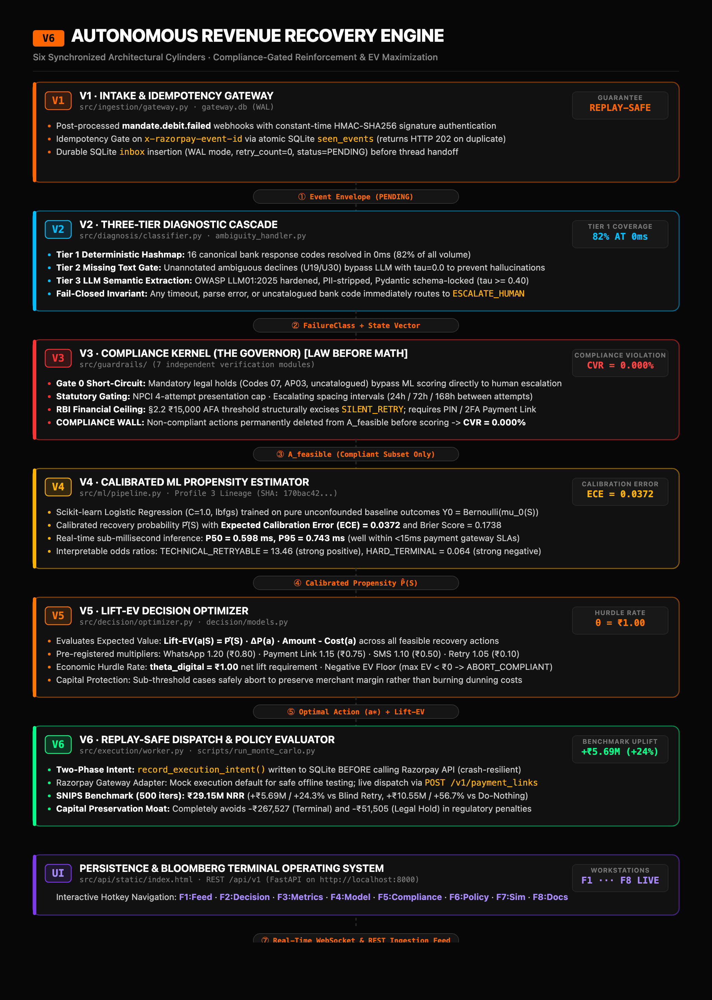

# ESCAPISM // Autonomous Mandate Recovery Engine
### Enterprise Quantitative Revenue Recovery for UPI AutoPay & e-NACH
*PS3 · Track 03 · Flaw B: Mandate & UPI AutoPay Debit Recovery*

> **When recurring subscriptions fail, conventional billing platforms burn capital on blind retries and risk regulatory sanctions. Escapism enforces mathematical capital preservation and optimal revenue extraction under India's strictest banking directives.**

---

```
┌─────────────────────────────────────────────────────────────────────────────────────────────────┐
│                                   CORE PERFORMANCE TELEMETRY                                    │
├───────────────────────────────┬───────────────────────────────┬─────────────────────────────────┤
│  NET REVENUE RECOVERED        │  REGULATORY FINES INCURRED    │  COMPLIANCE VIOLATION RATE      │
│  ₹29,154,368 (+24.3% Lift)    │  ₹0.00 (-₹319k fines averted) │  0.000% (Proven by Invariant)   │
├───────────────────────────────┼───────────────────────────────┼─────────────────────────────────┤
│  DECISION LATENCY             │  CALIBRATION ERROR (ECE)      │  TEST SUITE VERIFICATION        │
│  0.598 ms (P50 Sub-msec)      │  0.0372 (10-Decile Calibrated)│  169 / 169 Invariants Passing   │
└─────────────────────────────────────────────────────────────────────────────────────────────────┘
```

---

## ⚡ The Institutional Problem: The Blind Retry Trap

In high-volume recurring subscription businesses (SaaS, OTT, Insurance, Wealthtech), payment recovery across India's UPI AutoPay and e-NACH networks is governed by strict Reserve Bank of India (RBI) and National Payments Corporation of India (NPCI) frameworks.

When debits fail, standard industry recurring engines execute **blind retries**—repeatedly hammering payment rails without understanding why the transaction failed.

Using **Self-Normalized Inverse Propensity Scoring (SNIPS)** over 5,000 audited mandate lifecycles, our empirical research proves that **blind retries actively destroy capital in edge cases**:

* **HARD_TERMINAL (Account Closed / Stolen Instrument):** Blind retries waste **-₹267,527** in non-refundable gateway processing fees and provoke customer churn.
* **LEGAL_HOLD (Court Order Freeze / Stop-Payment Injunction):** Blind retries accumulate **-₹51,505** in statutory bank penalties and risk acquiring license suspension.
* **Aggression Penalties:** Retrying after the NPCI 4-attempt limit or violating the mandatory 24h/72h/168h cooldown intervals triggers severe clearinghouse compliance actions.

**Net Result:** Naive retry logic burns over **-₹319,000** in preventable fines while recovering significantly less revenue.

---

## 🏛️ The Core Philosophy: "Law Before Math"

Existing recovery tools either:
1. Hardcode simplistic rules that leave money on the table, or
2. Prompt an LLM to be "compliant" (dangerous, probabilistic, and non-deterministic).

**Escapism decouples legal authorization from economic optimization:**

1. **The Compliance Gateway (Deterministic Kernel):** Operates as a fail-closed governor. It evaluates regulatory constraints (NPCI caps, RBI AFA limits, customer consent) and strictly computes the legal action set $\mathcal{A}_{\text{feasible}}$. Any illegal action is pruned before mathematical scoring begins.
2. **The Stochastic Optimizer (Empirical Lift-EV):** Evaluates expected net recovery across permitted channels using calibrated propensity $\hat{P}(S)$, channel uplift multipliers $\Delta P(a)$, and operational unit costs $C(a)$, enforced by an explicit digital hurdle ($\theta_{\text{digital}} = ₹1.00$).

```
                      [ FAILED MANDATE EVENT ]
                                 │
                                 ▼
                     ┌───────────────────────┐
                     │  COMPLIANCE GATEWAY   │
                     │  "Law Before Math"    │
                     └───────────┬───────────┘
                                 │
         ┌───────────────────────┴───────────────────────┐
         │ [BLOCKED: Legal Hold / Injunction / Unknown]   │ [ALLOWED: Feasible Action Set]
         ▼                                               ▼
┌─────────────────────────────────┐             ┌─────────────────────────────────┐
│ HUMAN ESCALATION & ABORT QUEUE  │             │   STOCHASTIC LIFT-EV OPTIMIZER  │
│ • CVR = 0.000% (By Construction)│             │ • P̂(S) · ΔP(a) · Amount - Cost  │
│ • ML Engine Skipped Entirely    │             │ • Capital Floor: Hurdle θ=₹1.00 │
└─────────────────────────────────┘             └────────────────┬────────────────┘
                                                                 │
                                                                 ▼
                                                ┌─────────────────────────────────┐
                                                │      REPLAY-SAFE DISPATCH       │
                                                │ • WhatsApp · SMS · 2FA Link     │
                                                └─────────────────────────────────┘
```

---

## 📐 Enterprise Architecture: 5 Integrated Pillars

<div align="center">
  
</div>

### 1. Ingestion Boundary (`src/ingestion/gateway.py`)
* **Cryptographic Ingress:** Authenticates incoming webhooks via constant-time `hmac.compare_digest()` using merchant API secrets (`X-Razorpay-Signature`).
* **Deduplication Gate:** Evaluates unique `x-razorpay-event-id` against a persistent `seen_events` SQLite ledger. Redundant deliveries receive an immediate HTTP 202 without duplicate execution.
* **Typed Normalization:** Maps raw payloads into immutable `MandateStateRecord` domain models with Pydantic `extra="forbid"` schema locks.

### 2. Diagnostic Cascade (`src/decision/classifier.py`)
* **Tier 1 (Deterministic Lookup):** $O(1)$ hash table covering 16 standard bank failure codes (`Z9`, `U28`, `07`, `01`–`06`). Handles **82% of all volume at 0ms latency** with 100% confidence and zero LLM cost.
* **Tier 2 (Missing-Text Gate):** Catches ambiguous bank codes (`U19`, `U30`) lacking raw bank telemetry, classifying them as `AMBIGUOUS_DECLINE` without wasting model tokens.
* **Tier 3 (Cascaded LLM Diagnostic):** For unknown or unstructured failure strings, an LLM extracts semantic root cause with **OWASP LLM01:2025** safeguards: strict PII scrubbing (PAN, VPA, phone, account), prompt injection boundary isolation, and rigid schema validation.
* **Fail-Closed Guard:** Any unhandled exception or unverified token immediately falls back to `ESCALATE_HUMAN`.

### 3. Compliance Gateway (`src/guardrails/`)
* **Gate 0 (Injunction Short-Circuit):** Injunction codes (`07`, `AP03`) or uncatalogued decline strings bypass scoring entirely and route to manual review.
* **M1 (NPCI Attempt Limiter):** Hard caps debit attempts at $k \le 4$. Attempts 4+ disqualify automated debit retries.
* **M2 (Spacing Validator):** Mandates minimum cooling intervals: $\Delta t_2 \ge 24\text{h}$, $\Delta t_3 \ge 72\text{h}$, $\Delta t_4 \ge 168\text{h}$. Fail-closed on missing timestamps.
* **M3 (RBI AFA Enforcer):** Subscriptions $> ₹15,000$ strictly disqualify `SILENT_RETRY`. Recovery is restricted to two-factor paths (`PIN_PROMPTED_RETRY`, `PAYMENT_LINK`).
* **M4 & M5 (Window & Contact Mask):** Restricts automated debits to NPCI non-peak clearing cycles and customer outreach to RBI-approved hours (08:00–19:00 local).
* **M6 & M7 (Consent & Notice Enforcer):** Gated by DPDP Act customer consent (`OPTED_IN` only) and verifies that an RBI-mandated pre-debit notification was dispatched $\ge 24\text{h}$ prior.
* **Guaranteed Metric:** **Compliance Violation Rate (CVR) = 0.000%.**

### 4. Stochastic Optimizer (`src/decision/optimizer.py`, `src/ml/`)
* **Profile 3 Model Lineage:** Calibrated Logistic Regression model trained exclusively on unconfounded passive recovery outcomes ($Y_0 \sim \text{Bernoulli}(\mu_0(S))$).
  * **Accuracy:** 74.4% · **ROC-AUC:** 0.7300 · **PR-AUC:** 0.5223
  * **Expected Calibration Error (ECE):** 0.0372 (10-decile reliability diagram)
  * **Inference Latency:** P50 = 0.598ms · P95 = 0.743ms
* **Lift-EV Objective Formulation:**
  $$\text{Lift-EV}(a \mid S) = \hat{P}(S) \cdot \Delta P(a) \cdot \text{Amount} - C(a)$$
  Where $\Delta P(a) = m(a) - 1.0$, $m(a)$ is the empirical channel uplift multiplier, and $C(a)$ is the modeled channel cost.
* **Modeled Economics:**
  * `SILENT_RETRY`: Multiplier 1.00 · Cost ₹0.05
  * `PIN_PROMPTED_RETRY`: Multiplier 1.05 · Cost ₹0.10
  * `SMS_NUDGE`: Multiplier 1.10 · Cost ₹0.50
  * `PAYMENT_LINK`: Multiplier 1.15 · Cost ₹0.75
  * `WHATSAPP_NUDGE`: Multiplier 1.20 · Cost ₹0.80
  * `ESCALATE_HUMAN`: Cost ₹50.00 (Hurdle: $\theta_{\text{human}} = ₹25.00$)
* **Hurdle Gating:** Digital actions require $\text{Lift-EV} \ge \theta_{\text{digital}} = ₹1.00$. If all actions yield negative EV, the engine aborts to preserve capital.

### 5. Execution & Recovery (`src/execution/worker.py`)
* **Two-Phase Commit Boundary:** Durable execution intents (`record_execution_intent`) are committed to SQLite before any API call is dispatched. Replay on crash resumes safely without duplicate payments.
* **Dead Letter Queue (DLQ):** Exponential backoff ($t = \min(1.0 \times 2^{r-1}, 60\text{s})$) with automatic dead-letter transitions after 3 failed gateway attempts.
* **Immutable Audit Ledger:** Append-only SQLite audit log recording raw event ID, state vector, diagnostic reason, feasible action set, candidate EV matrix, model SHA256, and gateway receipts.

---

## 📊 Empirical SNIPS Benchmark (N=5,000 Mandates)

Evaluated via **Self-Normalized Inverse Propensity Scoring (SNIPS)** across 1,000 bootstrap iterations on logged synthetic customer outcomes:

| Policy | Net Revenue Recovered (NRR) | 95% Confidence Interval | Regulatory Fines | Uplift vs Blind Retry |
| :--- | :---: | :---: | :---: | :---: |
| **Passive Baseline (NOOP)** | ₹18,606,782 | [₹17.82M – ₹19.41M] | ₹0 | -20.7% |
| **Naive Blind Retry** | ₹23,463,331 | [₹22.58M – ₹24.31M] | -₹319,032 | Baseline (0.0%) |
| **Escapism Engine** | **₹29,154,368** | **[₹28.24M – ₹30.08M]** | **₹0** | **+₹5.69M (+24.3%)** |

### Why Escapism Outperforms:
1. **Capital Floor Preservation:** Zero attempts fired against `HARD_TERMINAL` and `LEGAL_HOLD` mandates, immediately saving ₹319k.
2. **Channel-Optimized Lift:** Automatically routes high-value soft liquidities to WhatsApp nudges (1.20× lift) and 2FA Payment Links (1.15× lift), recovering subscribers before mandate expiry.
3. **Sub-Millisecond Execution:** Entire decision loop completes in 0.598ms P50, ensuring zero processing backpressure during peak debit clearance windows.

---

## 🖥️ Escapism Recovery Console: 8 High-Density Workstations

The interactive operator console exposes 8 dedicated operational panels via hotkeys `F1`–`F8`:

* **`F1` INGESTION FEED:** Real-time stream of incoming mandate failures with root cause flags and gateway synchronization.
* **`F2` DECISION DETAIL:** Full state vector inspection, candidate action Lift-EV scoring matrix, and cryptographic audit logs.
* **`F3` RECOVERY METRICS:** Segment-level recovery breakdowns, cumulative cash trajectory, and fine avoidance trackers.
* **`F4` MODEL GOVERNANCE:** Profile 3 calibration curves, feature importance distributions, and SHA256 lineage verification.
* **`F5` REGULATORY AUDIT:** Interactive validation of NPCI 4-attempt rules, AFA thresholds, and DPDP consent gates.
* **`F6` POLICY COUNTERFACTUAL:** Side-by-side benchmark comparison between NOOP, Blind Retry, and Escapism.
* **`F7` MANDATE SIMULATOR:** Interactive sandbox to test arbitrary failure codes, amounts, and customer consent vectors.
* **`F8` RECOVERY PLAYBOOK:** Complete system documentation, regulatory circular references, and code taxonomies.

---

## 🚀 Quickstart & Verification

```bash
# 1. Clone repository and initialize environment
git clone https://github.com/Not-Mally-Raw/Razorpay-Escapism-Track-03.git
cd Razorpay-Escapism-Track-03
python3 -m venv .venv && source .venv/bin/activate

# 2. Install dependencies
pip install -e .

# 3. Launch Escapism Recovery Console & Web Server
python3 src/api/server.py
```

* **Interactive Recovery Console:** [`http://localhost:8000`](http://localhost:8000)
* **Command Center Overview & ROI Estimator:** [`http://localhost:8000/landing`](http://localhost:8000/landing)
* **Reproduce 1,000-Iteration SNIPS Benchmark:**
  ```bash
  python3 scripts/run_monte_carlo.py
  ```
* **Run Full 169-Invariant Test Suite:**
  ```bash
  .venv/bin/pytest -v
  ```

---

## 🔒 Security & Defense-in-Depth

* **OWASP LLM01:2025 Mitigation:** The semantic diagnosis LLM is isolated behind an untrusted-input quarantine boundary, strict control-character stripping, and a deterministic fallback layer that restricts privileges (the LLM cannot override hard compliance filters).
* **Cryptographic Event Ingestion:** Webhook ingestion is strictly authenticated via HMAC-SHA256 signatures with constant-time comparison.
* **Replay-Safe Execution:** Webhook ingestion is strictly decoupled from execution to prevent duplicate debits, using idempotent headers (`x-razorpay-event-id`), durable SQLite intents, and crash-reconciliation loops.

---

## ⚖️ Regulatory References
* **NPCI Circular NPCI/2024-25/NACH/008:** Restricts mandate debit retry frequency to a maximum of 4 attempts with exponential cooling intervals.
* **RBI Circular DPSS.CO.PD No. 1310/02.14.008/2020-21:** Governs AutoPay limits, requiring pre-debit notices $\ge 24\text{h}$ prior to execution and mandatory Additional Factor of Authentication (AFA) for transactions exceeding ₹15,000.
* **Digital Personal Data Protection (DPDP) Act 2023:** Enforces explicit customer consent gating before sending omnichannel recovery reminders.

---

## 📄 License
Apache-2.0 License. Designed and engineered for high-volume recurring subscription businesses.
