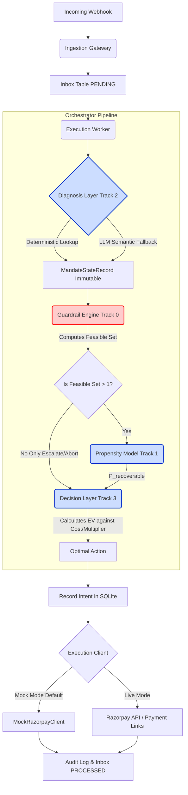

# Architecture & System Boundaries

This document specifies the end-to-end data flow, execution reliability guarantees, and transparent system boundaries of the Razorpay Revenue Recovery Engine.

---

## 1. Subsystem Roles

1. **Diagnosis (Track 2):** Classifies the raw bank error code and text into one of 5 canonical failure classes upstream of state construction.
2. **Guardrails (Track 0):** Enforces hard regulatory limits (NPCI max 4 attempts, RBI ₹15K AFA limits, 24h/72h spacing, 8AM-7PM contact hours, channel consents).
3. **Propensity (Track 1):** Logistic Regression estimating the probability that the customer has sufficient liquidity to recover the payment.
4. **Decision (Track 3):** Combines the feasible set and the propensity score to select the action with the highest Expected Value (EV), constrained by the safety threshold $\theta_{\text{digital}}$.
5. **Execution & Durability (Track 4):** Replay-safe SQLite intent recording, idempotency key enforcement, bounded exponential backoff retries, dead letter queue (DLQ) transitions, and deterministic crash reconciliation.

---

## 2. System Boundaries & Execution Disclosures

### Certified Execution Modes
- **Default Execution Mode (`MockRazorpayClient`):** The system defaults to mock execution mode for deterministic offline testing, Monte Carlo simulations, and benchmark verification without generating live financial side-effects or external network dependencies.
- **Live Execution Mode (`RazorpayClient`):** Live dispatch requires explicitly setting `RAZORPAY_EXECUTION_MODE=live` alongside valid `RAZORPAY_KEY_ID` and `RAZORPAY_KEY_SECRET`. Live mode dispatches real API calls to the Razorpay Payment Links API (`/v1/payment_links`).

### Omnichannel Notification Dispatch
- Omnichannel recovery nudges (`WHATSAPP_NUDGE`, `SMS_NUDGE`, `PAYMENT_LINK`, `RE_MANDATE_FLOW`, `PIN_PROMPTED_RETRY`) dispatch webhook intents and Razorpay Payment Link workflows with customer contact metadata (`contact`, `email`, `reference_id`) rather than direct telecom / SMS aggregator integrations.

---

## 3. Execution Reliability & Durability Invariants

### Replay-Safe Dispatch Intent
- Before dispatching any external API call, the worker records an explicit execution intent record in SQLite (`execution_intents` table) with `intent_id`, `event_id`, `action`, `idempotency_key`, and `status = 'PENDING'`.
- Replay calls with identical `event_id` detect the existing completed intent and reuse the cached gateway receipt without duplicating external API calls.

### Idempotency Key Preservation
- The idempotency key (`x-razorpay-event-id`) is preserved across all retries and transmitted in API headers (`x-razorpay-event-id`, `X-Idempotency-Key`) and body payload metadata (`reference_id`).

### Deterministic Outcome Reconciliation
- Interrupted executions (e.g. worker process crashes between API dispatch and DB finalization) are reconciled deterministically at worker startup or retry via `reconcile_interrupted_executions()`.
- The reconciliation worker queries gateway/client status using the preserved idempotency key, records the receipt, updates `seen_events`, marks `inbox` as `PROCESSED`, and sets intent status to `RECONCILED`.

### Bounded Exponential Backoff & Dead Letter Queue (DLQ)
- Transient execution failures follow bounded exponential backoff:
  $$\text{delay} = \min(\text{INITIAL\_BACKOFF} \cdot (\text{BACKOFF\_FACTOR}^{\text{retry\_count} - 1}), \text{MAX\_BACKOFF})$$
- Default parameters: `INITIAL_BACKOFF = 1.0s`, `BACKOFF_FACTOR = 2.0`, `MAX_BACKOFF = 60.0s`, `MAX_RETRIES = 3`.
- When an event exceeds `MAX_RETRIES` or encounters non-retryable ingestion errors (`WebhookIngestionError`), it transitions cleanly to `DEAD_LETTER` (or `FAILED`) status in `inbox` and is durably recorded in `dead_letter_queue` with error details, stack traces, and attempt counts.

### Rich Durable Audit Logging
- Every processed event writes an immutable JSON record to `audit_log` capturing:
  - `event_id` / `raw_event_id`: Unique event identifier
  - `timestamp`: UTC ISO-8601 execution timestamp
  - `state`: Serialized `MandateStateRecord`
  - `diagnostic`: Serialized `DiagnosticOutput` (failure class, confidence, evidence)
  - `feasible_action_set`: List of compliant actions computed by guardrails
  - `candidate_scores`: Itemized evaluation scores for all candidate actions (multiplier, cost, lift probability, lift EV)
  - `model_version_hash`: SHA256 provenance hash of the ML propensity model
  - `action`: Selected optimal action
  - `action_result` / `gateway_receipt`: Gateway receipt payload
  - `decision`: Full decision optimization result
  - `worker_id`: Worker identity string
  - `intent_id`: Execution intent identifier
