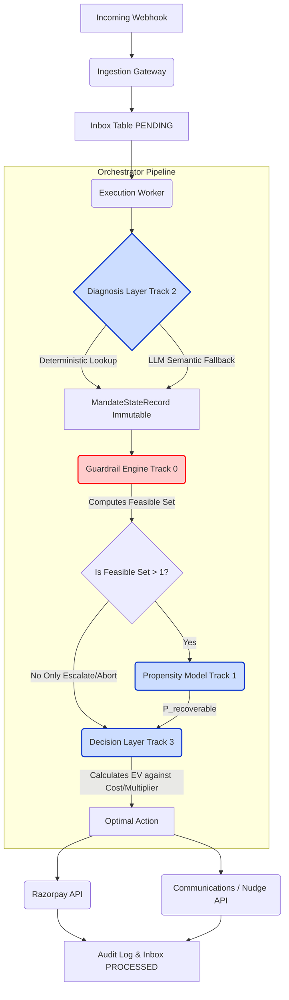

# Architecture Diagram

This mermaid diagram maps the end-to-end data flow of a webhook failure event through the four core subsystems of the Orchestrator.

### Subsystem Roles
1. **Diagnosis (Track 2):** Classifies the raw bank error code and text into one of 5 canonical failure classes.
2. **Guardrails (Track 0):** Enforces hard regulatory limits (NPCI max attempts, RBI ₹15K AFA limits, 8AM-7PM contact hours).
3. **Propensity (Track 1):** Logistic Regression estimating the probability that the customer has sufficient liquidity to recover the payment.
4. **Decision (Track 3):** Combines the feasible set and the propensity score to select the action with the highest Expected Value (EV), constrained by the safety threshold `θ_digital`.
