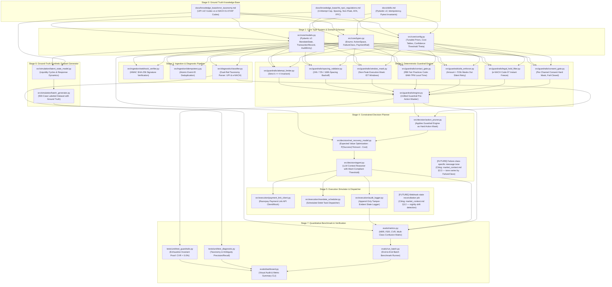

# Topological Learning & Dependency Graph
### System: AI Revenue Recovery (Track 03 — Flaw B: Mandate & UPI AutoPay Debits)

This graph specifies the strict build sequence and conceptual dependencies required to construct the revenue recovery engine. No higher-level component may be implemented until all its prerequisite nodes are fully defined and tested.

---

## 2. Construction Sequence & Milestones

1. **Milestone 0 — Knowledge Base & Schema Lock:** Formalize all regulatory numbers, error codes, Pydantic v2 schemas, and typed invariants in `docs/knowledge_base/`.
2. **Milestone 1 — Standalone Guardrail Engine:** Build deterministic guardrail filters with 100% test coverage proving zero compliance violations before building any agent.
3. **Milestone 2 — Webhook Ingestion & Diagnostic Classifier:** Implement signature verification, deduplication, and dual-rail taxonomy mapping.
4. **Milestone 3 — Constrained Action Optimization:** Combine deterministic guardrail action masking with expected net recovery scoring and LLM contextual reasoning.
5. **Milestone 4 — Synthetic Benchmark & Ground-Truth Simulator:** Generate 500 labeled failure cases with salary cycles and customer response dynamics.
6. **Milestone 5 — Evaluation Harness & Proof Dashboard:** Run the end-to-end evaluation suite to compute NRR, FER, CVR (0.0%), and confusion matrices.
